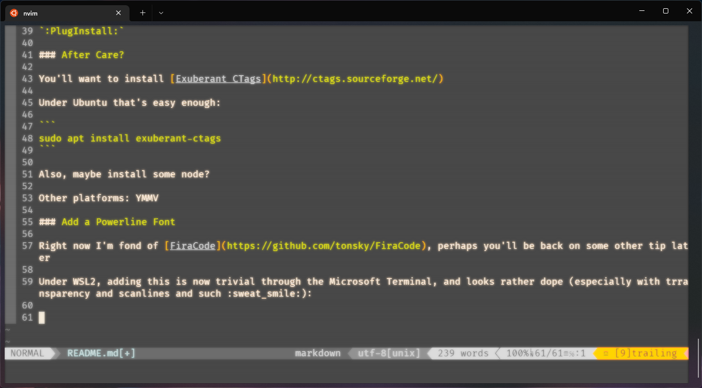

 # .vim (`.vimrc` in `$HOME/.config/nvim/`)

I'm tired of constantly having to remember how to set up and configure vim.

 Updated: 2023-01-01 - I have made some adjustments to try switching to a Lua config. I'm taking small steps and instead of using my `.vimrc` as `init.vim`, I'm linking to `legacy.vim` for the time being, with the plan of gradually bringing the configuration over. I have also added lazy.nvim and gen.nvim.

This document will just assuming I'm rolling forward forever, check the git history for older configurations. Good luck.

This installation is taking place on Ubuntu 20.04 WSL. I wish it was possible to use Arch under Windows instead :fingers-crossed:

For this iteration, I plan to relocate everything to live within the `$HOME/.config/nvim` folder as it's been long enough that I've put off dealing with this. (I anticipate a file path update will be necessary along with an update to the `README.md`.)

Next, I may attempt to automate this process. :rolling-eyes:

## Initial Commands

1. Create a new config directory and navigate into it:
   ```bash
   mkdir -p $HOME/.config/nvim && cd $HOME/.config/nvim
   ```
2. Clone the repository:
   ```bash
   git clone git@github.com:ephbaum/.vim.git gitnvim
   ```
3. Create necessary directories:
   ```bash
   mkdir swapfiles backups
   ```
4. Symlink your `.vimrc` file:
   ```bash
   ln -s ~/.config/nvim/gitnvim/.vimrc ~/.config/nvim/legacy.vim
   ```
5. Symlink your `init.lua` file:
    ```bash
    ln -s ~/.config/nvim/gitnvim/lua/init.lua ~/.config/nvim/init.lua
    ```

## Plugins

Then, follow the Neovim instructions to use [Vim Plug](https://github.com/junegunn/vim-plug):

```bash
sh -c 'curl -fLo "${XDG_DATA_HOME:-$HOME/.local/share}"/nvim/site/autoload/plug.vim --create-dirs \
    https://raw.githubusercontent.com/junegunn/vim-plug/master/plug.vim'
```

After launching `nvim`:

```vim
:PlugInstall
```

## After Care

You will want to install [Exuberant CTags](http://ctags.sourceforge.net/) for improved tagging functionality. Under Ubuntu, that's straightforward:

```bash
sudo apt install exuberant-ctags
```

Additionally, consider installing Node.js if needed. Other platforms may vary.

## Powerline Font

Currently, I prefer [FiraCode](https://github.com/tonsky/FiraCode). However, that preference might change later.

Under WSL2, adding this font is now simple using the Microsoft Terminal. It looks particularly impressive with transparency and scanlines enabled:


