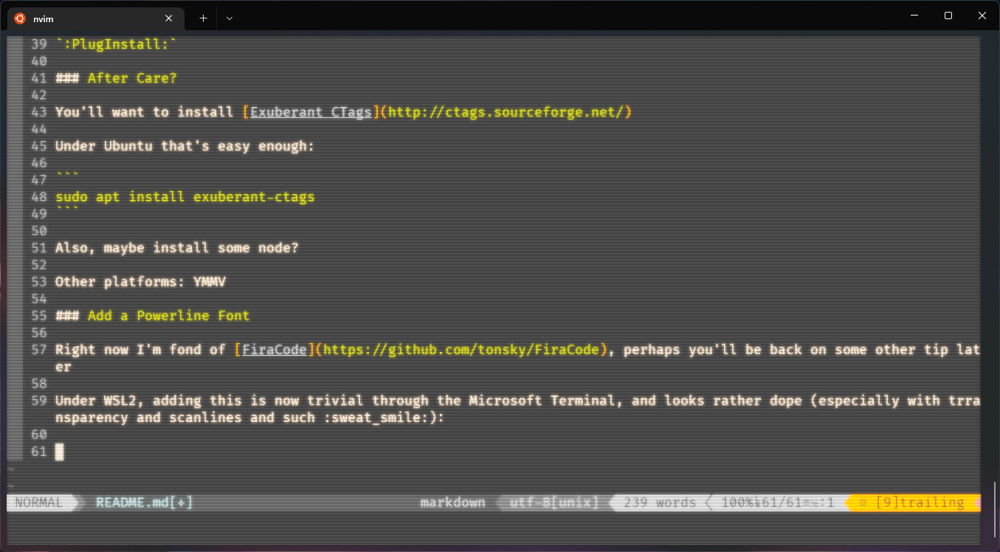

# .vim

My neovim configuration. The repo is named `.vim` for historical reasons — it
used to *be* `~/.vim`. It now lives at `~/.config/nvim/gitnvim` and is wired
into neovim by two symlinks.

I got tired of relearning how to set this up every time I moved machines, so
the setup steps and the reasoning behind the current layout are written down
here rather than rediscovered.

## Setup

```bash
mkdir -p $HOME/.config/nvim && cd $HOME/.config/nvim
git clone git@github.com:ephbaum/.vim.git gitnvim
cd gitnvim && ./setup.sh
```

Then launch `nvim` and wait. lazy.nvim bootstraps itself and installs
everything on first start, and coc installs its extensions from
`vim.g.coc_global_extensions`.

The clone has to be named `gitnvim` and live at `~/.config/nvim` — `.vimrc`
and `lua/init.lua` reference that path absolutely. `setup.sh` refuses to run
from anywhere else rather than half-working.

`setup.sh` creates `swapfiles/`, symlinks `init.lua` and `legacy.vim`, and
checks for `nvim`, `node`, `git`, `ctags` and `ripgrep`. It installs no plugin
manager — lazy.nvim bootstraps itself. It's idempotent — anything it would
overwrite is moved aside with a timestamp instead.

```bash
./setup.sh --check   # verify an existing install, change nothing
./setup.sh --force   # replace files that would otherwise block the install
```

### Also worth knowing

- **ctags** must be
  [Universal Ctags](https://github.com/universal-ctags/ctags)
  (`sudo apt install universal-ctags`), not Exuberant Ctags, which this README
  recommended for years despite it being unmaintained since 2009.
- **[FiraCode](https://github.com/tonsky/FiraCode)** is the font this is tuned
  for. Under WSL, install it on the Windows side and pick it in Windows
  Terminal.



## Keybindings

Leader is <kbd>Space</kbd>.

### Editing

| Key | Does |
|---|---|
| `<leader>wr` | toggle wrap |
| `<leader>rtw` | strip trailing whitespace in buffer |
| `<leader>l` | delete to start of line, then join down |
| `<leader>dt` | insert current date/time |
| `<leader>sp` / `<leader>nsp` | spellcheck on / off |
| `<S-CR>` | enter insert mode (normal) / leave it (everywhere else) |
| `gcc` / `gc` | toggle comment — line / motion or visual (Comment.nvim) |
| `<Tab>` / `<S-Tab>` | indent / outdent list item (markdown only) |

### Windows and navigation

| Key | Does |
|---|---|
| `<leader>=` / `<leader>-` | widen / narrow window by a third |
| `<leader>+` / `<leader>_` | taller / shorter by a third |
| `<leader>nt` | toggle nvim-tree |
| `<leader>tt` | Tagbar |
| `<leader>uu` | Gundo undo tree |
| `<leader>sc` | scratch buffer |

### Find (telescope)

| Key | Does |
|---|---|
| `<leader>ff` | find files |
| `<leader>fg` | live grep (ripgrep) |
| `<leader>rr` | tags in current buffer |

### LSP / coc

| Key | Does |
|---|---|
| `gd` `gy` `gi` `gr` | definition / type / implementation / references |
| `K` | hover docs |
| `[g` `]g` | previous / next diagnostic |
| `<leader>rn` | rename symbol |
| `<leader>f` | format selection |
| `<leader>ac` / `<leader>qf` | code action on buffer / quickfix current line |
| `if` `af` `ic` `ac` | function / class text objects |
| `<leader>a` | code action on motion or selection (e.g. `<leader>aap`) |
| `<C-s>` | expand selection range |
| `<Tab>` / `<S-Tab>` | next / previous completion item |
| `<CR>` | confirm completion |
| `<leader>c` + `a e c o s j k p` | CocList: diagnostics, extensions, commands, outline, symbols, next, prev, resume |

### AI (gen.nvim → local ollama)

| Key | Does |
|---|---|
| `<leader>]` | prompt Gen |
| `<leader><leader>ss` | fix grammar/spelling in selection |

### Two mappings that changed in 2026-08

Both were stale copy-paste from successive versions of coc's example config,
and both were silently broken. Fixed, but they're the kind of thing muscle
memory notices:

- **CocList moved from `<space>x` to `<leader>cx`.** Since leader *is* space,
  those were `<leader>` mappings wearing a disguise: `<space>a` shadowed
  `<leader>a` (code action) completely, and `<space>s` made `<leader>sp` and
  `<leader>sc` wait on timeout. The group now has a prefix of its own.
- **`<CR>` was mapped twice.** An older `complete_info()` recipe sat below the
  modern `coc#pum#confirm()` one and overrode it, so `coc#on_enter()` never
  fired — no format or snippet expansion on confirm. The old block is gone.

## Layout

| File | What it is |
|---|---|
| `lua/init.lua` | entry point — lazy.nvim, plugin list, coc extensions, then sources `.vimrc` |
| `.vimrc` | the original vimscript config, symlinked as `legacy.vim`. Options, keymaps, and all the coc boilerplate |
| `setup.sh` | install or verify this config on a machine |
| `scripts/` | the CI checks, all runnable by hand |

### One plugin manager

lazy.nvim manages everything, coc.nvim included. Two files load, in this
order: `lua/init.lua`, which sources `.vimrc` (as `legacy.vim`) near its end.

The order is load-bearing in two places. `mapleader` and
`coc_global_extensions` are both set *before* `lazy.setup()` — the first so
plugin `config()` functions bind to <kbd>Space</kbd> and not `\`, the second
because that's when coc's plugin file loads and reads it. And `.vimrc` is
sourced *after* `lazy.setup()`, because its coc mappings reference
`<Plug>(coc-*)`, which doesn't exist until coc has loaded.

### CI

`.github/workflows/ci.yml` runs two jobs.

**lint** — no editor needed. `shellcheck` on `setup.sh`,
`scripts/check-keymaps.py` for mappings that override each other, and two
guards that exist because of things this repo actually did: nothing matching
editor state (swap files, tags indexes, netrw bookmarks) may be tracked, and
no tracked file may contain an absolute `/home/…` or `/Users/…` path.

**smoke** — installs neovim, node, ctags and ripgrep, runs `setup.sh` from
the path the config expects, installs the plugins, then asserts that startup
writes nothing to stderr and runs `scripts/ci-assert.vim`. It runs against
both `stable` and `nightly` neovim; nightly is `continue-on-error`, so it
warns about a coming release without failing a branch for something no commit
here caused.

`ci-assert.vim` is the point of the whole thing. The 2026 statusline bug made
nvim exit 0 while half the config silently never ran, so exit codes prove
nothing here. It places tripwires at increasing depths of the load order —
lazy's plugin `config()` functions, early `legacy.vim`, past the statusline
region, the last lines of `legacy.vim`, then back in `init.lua` after the
`source`. When one fails, the last one that passed is where loading gave up.

Those tripwires prove which *files* ran, not that any plugin installed —
`<leader>nt` is mapped in `legacy.vim` whether or not nvim-tree exists. So a
second group checks for things only the plugin itself provides
(`:NvimTreeToggle`, `gcc`, lualine's `&statusline`, `:Gen`, `:CocList`). It
checks that coc *loaded*, not that its extensions installed — that's async and
network-bound, and asserting it would trade a real signal for a flaky one.

And because an assertion harness that has never failed isn't yet known to
work, a final step runs `ci-assert.vim` against a deliberately broken config
(one mapping unmapped) and fails if it *passes*.

`scripts/check-keymaps.py` and `./setup.sh --check` are both worth running
locally; neither needs anything installed. The keymap checker reads
`lua/init.lua` as well as `.vimrc`, which matters — `<leader>f` (coc
format-selected) is a prefix of telescope's `<leader>ff` and `<leader>fg`, and
no single file contains both sides of that.

### WSL clipboard

`.vimrc` sets `clipboard+=unnamedplus` and deliberately declares **no**
`g:clipboard` provider. Neovim picks one itself; under WSL it falls back to
`clip.exe` and powershell. `:checkhealth provider` reports what it chose.

A `win32yank.exe` provider was configured here briefly in 2026 and removed.
It didn't reliably work, and it put a third-party binary in the path of
everything copied out of the editor. If the clipboard isn't crossing into
Windows, fix it on the Windows or WSL side rather than reinstating a helper.

## History

Eleven years of moving between machines and rewriting this thing. Sparse
commit messages, so the dates carry most of the story.

| | |
|---|---|
| **2015** | Started on macOS with Vundle. tern, YouCompleteMe, jshint — the pre-LSP JavaScript stack. |
| **2016** | Polyglot arrives and starts absorbing the individual syntax plugins. |
| **2018** | First README. `.vimtags` noticed to be per-machine and, in theory, stopped being tracked. |
| **2020** | Vundle → vim-plug. `.gitignore` gets serious. Ubuntu 20.04 under WSL. |
| **2021–2022** | Manjaro → Ubuntu, another machine migration, several rounds of path fixing (*"Maybe this is the right path forever"*). |
| **2023** | Everything relocates into `$HOME/.config/nvim`. coc.nvim arrives, transparency, astro. |
| **2024** | Lua config: `init.lua` becomes the entry point, `.vimrc` demoted to `legacy.vim`, lazy.nvim and gen.nvim added. Migration deliberately partial. |
| **2026** | Statusline crash fixed, coc actually armed, plugin set modernized. Swap files and a ctags index scrubbed from history. A win32yank clipboard provider added and removed again. netrw retired in favour of nvim-tree. |

### 2026-07-04 — the modernization pass

Picked this config up on a new machine and it was silently broken: `nvim`
started, but a big chunk of keybindings just didn't exist.

**The startup bug.** `legacy.vim` had `set statusline^=%{coc#status()}...` —
prepending onto the statusline. vim-airline sets `&statusline` starting with
`%!airline#statusline(1)...`, and `%!` is only legal as the very first two
characters of the option. Prepending in front of it produced `E539: Illegal
character <!>`, a hard error rather than a warning. Because `legacy.vim` is
sourced from `init.lua` via `vim.cmd('source ...')`, that error aborted
execution on the spot — so everything after it in `legacy.vim` (all the coc
keymaps: `gd`, `gr`, `K`, rename, format, code actions, `CocList`) and
everything after it in `init.lua` (coc's own plugin file, the gen.nvim
keymaps) silently never ran. `^=` → `+=` fixed it, and prompted the rest of
this pass.

**coc.nvim had zero extensions.** It was wiring up the completion UI with no
language server behind it — `:CocList extensions` was empty. Now declared in
`lua/init.lua` via `vim.g.coc_global_extensions`, which coc auto-installs from
on startup. (The PHP one is `coc-phpls`, not `coc-intelephense` — it wraps
intelephense but that isn't the package name.)

With coc actually doing diagnostics, `syntastic` (deprecated by its own author
years ago) became redundant and could fight it over the statusline and
loclist. Removed, along with `vim-phpcs` and the `g:syntastic_*` settings.

**Plugin swaps.**

| Was | Now | Behavior change |
|---|---|---|
| `bling/vim-airline` | `lualine.nvim` | statusline only, no keybinding change. Gruvbox theme, coc status as a component. |
| `scrooloose/nerdtree` | `nvim-tree.lua` | `<leader>nt` still toggles, now via `:NvimTreeToggle`. |
| `scrooloose/nerdcommenter` | `Comment.nvim` | **comment toggle is now `gcc` / `gc`.** No custom nerdcommenter binding existed, so this is the one to relearn. |
| `ctrlpvim/ctrlp.vim` | `telescope.nvim` | `<leader>ff`, `<leader>fg`, `<leader>rr`. |

Also pruned as unreachable: `tern_for_vim` and `jshint.vim` (pre-LSP JS,
superseded by coc), the unused colorschemes (`badwolf`, `molokai`,
`vim-vividchalk`, `vim-lucius`), `vim-game-snake`, and two orphaned
`g:easytags_*` settings left over from an even older migration.

**Leader timing.** `mapleader` is now set at the top of `lua/init.lua`, before
`lazy.setup()`. Plugin `config` functions run *during* `lazy.setup()` — if
`mapleader` isn't set by then, `<leader>` silently falls back to `\` and the
keymaps bind to the wrong key with no error. `.vimrc` still sets it too, which
is now a harmless no-op.

### 2026-08-15 — CI hardening

The CI added a few days earlier had holes, found by reading it rather than by
it failing:

- **Plugin installs were masked.** All three install commands ended in
  `|| true`, and of the lazy plugins only telescope binds keys inside
  `config()` — so it was the only one the assertions could see. nvim-tree,
  lualine and Comment.nvim could all have failed to install with CI still
  green. The sync no longer swallows failures, and there are now assertions
  for things only the plugins themselves provide.
- **The keymap checker couldn't see `lua/init.lua`.** It found the
  `<leader>f` / `<leader>ff` ambiguity immediately once it could.
- **It also missed mappings defined inside an `:autocmd`.** The regex anchored
  on the first word of the line, read `au`, and moved on — so the markdown
  `<Tab>` and `<S-Tab>` mappings were invisible.
- **`version: stable` floated.** A neovim release could turn the branch red
  with no commit here. Now a `stable` + `nightly` matrix, nightly advisory.
- **The tripwires had never been seen to fire.** There's a step for that now.
- **`vim.loop` is deprecated** in favour of `vim.uv`. Since CI fails on
  anything written to stderr during startup, and deprecation warnings go to
  stderr, that was a build break waiting for a release.

### 2026-08-15 — vim-plug retired

The 2024 lua migration was deliberately partial: `vim-misc`, `vim-session` and
`coc.nvim` stayed on vim-plug in `bundles.vim` and never followed. That cost a
second plugin manager, the `:checkhealth` warning about "paths on the rtp from
another plugin manager", and a hand-written
`source ~/.local/share/nvim/plugged/coc.nvim/plugin/coc.vim` at the end of
`init.lua` — because coc's plugin file wasn't on lazy's runtimepath.

- **coc.nvim** moved to lazy.nvim as `{ 'neoclide/coc.nvim', branch = 'release' }`.
  Its `release` branch ships built JS, so there's nothing to compile, and it
  carries no lazy-loading handler on purpose — it must load during
  `lazy.setup()` so `<Plug>(coc-*)` exists by the time `legacy.vim` maps to it.
  `vim.g.coc_global_extensions` moved *above* `lazy.setup()` for the same
  reason.
- **vim-session and vim-misc** dropped. Autoload and autosave were both `'no'`,
  so it was two plugins providing a manual `:SaveSession`. `:mksession` and
  `nvim -S Session.vim` cover it; `Session.vim` stays gitignored.

`bundles.vim` is gone, `setup.sh` no longer downloads anything (so `curl` is
off the dependency list), and the CI smoke job dropped its `+PlugInstall` step.

### 2026-08-15 — pruning inert config

Same spirit as the netrw removal: things that were still being loaded, or
still being maintained in `.gitignore` and `setup.sh`, without doing anything.

| Gone | Why |
|---|---|
| `terryma/vim-multiple-cursors` | deprecated by its own author, who points at `mg979/vim-visual-multi`. Nothing replaced it, so `<C-n>` / `<C-p>` are free. |
| `kien/rainbow_parentheses.vim` | unmaintained for about a decade, and it ran four autocmds on every startup. |
| `g:python_host_prog` | pointed at python2. Neovim removed that provider entirely — it existed to give `:checkhealth` something to complain about. |
| `set cmdheight=2` | coc needed the extra row once. It doesn't now, and the row is better spent on the buffer. |
| the commented-out cursorline block | colors picked for molokai, disabled for years. |
| `backupdir` + `backupfiles/` | `.vimrc` sets `nobackup` and `nowritebackup`, so nothing was ever written there — but `setup.sh` created the directory, `.gitignore` guarded it, and CI checked it wasn't tracked. |

### 2026-08-15 — netrw removed

`netrw-tree.vim` configured netrw as a file-tree sidebar on `<leader>lex`. It
predated nvim-tree and had been redundant since nvim-tree arrived in 2024;
two file trees on two keys is one file tree and a distraction. Gone, and netrw
itself is now disabled in `lua/init.lua` (`g:loaded_netrw`,
`g:loaded_netrwPlugin`) — which is what nvim-tree's own docs ask for, since
with both live the winner of a directory-open race is whichever hooked
`BufEnter` first.

Two side effects worth knowing:

- `<leader>l` (delete to start of line, then join down) is **faster now**. It
  was a prefix of `<leader>lex`, so every press sat out `timeoutlen` first.
- `:Explore` and netrw's remote-file editing (`nvim scp://host/path`) are gone
  with it. `gx` is fine — neovim stopped routing that through netrw in 0.10.

The file also carried a vendored copy of an old `netrw#Lexplore()` that
nothing had called in years. It went with it.

### 2026-08-15 — history scrub

Swap files, a ctags index, and netrw bookmarks had been committed years
earlier and carried forward ever since. All removed from history with
`git-filter-repo`; commit SHAs from 2015 onward changed as a result. If you
have an old clone, `git fetch && git reset --hard origin/main` — a `git pull`
would merge the removed files back in.

`.gitignore` was rebuilt in the same pass to actually match where this config
writes, with each entry annotated with the setting that produces it.
